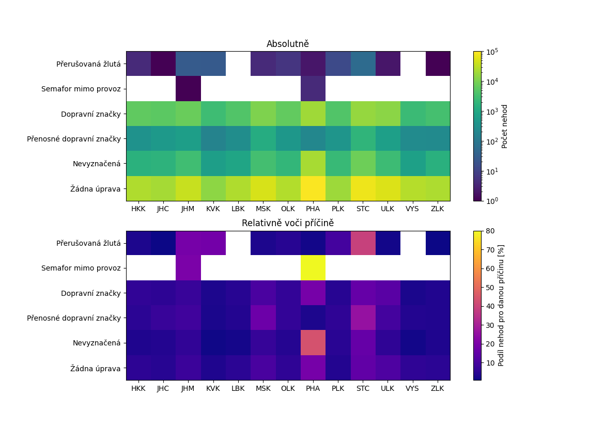

### IZV - Data Analysis and Visualization in Python
#### Project 1 - Data preparation

-----

`The DataDownloader` class in `download.py` is a Python class that provides functionality for downloading and parsing data from a website. Specifically it downloads data from the Czech republic Police website. The data is about traffic accidents in the Czech republic. The data is downloaded in a form of a zip file. The zip file contains a csv file with the data and a pdf file with a description of the data. The csv file is parsed and the data is stored in a pandas DataFrame. The DataFrame is then saved as a pickle file. The class also provides functionality for loading the data from the pickle file.

The `DataDownloader` class has the following attributes:

- `headers`: A list of column headers for the data files.
- `regions`: A dictionary mapping region names to CSV file names.
- `data_types`: A list of data types corresponding to the column headers.

The `DataDownloader` class provides the following methods:

- `__init__(self, url="https://ehw.fit.vutbr.cz/izv/", folder="data", cache_filename="data_{}.pkl.gz")`: Initializes the class with the specified URL, folder, and cache filename.
- `download_data(self)`: Downloads the data files from the website.
- `parse_region_data(self, region)`: Parses the data for the specified region from the downloaded files and returns it as a dictionary.
- `get_dict(self, regions=None)`: Retrieves the parsed data for the specified regions as a dictionary. If no regions are specified, data for all regions is returned.
Note: The `download_data()` method should be called before calling the `parse_region_data()` or `get_dict()` methods to ensure that the data files are available for parsing.

### Usage

1. Run the code using the following command:

`` python get_stat.py [--fig_location FIG_LOCATION] [--show_figure]  ``

Optional arguments:

- `--fig_location FIG_LOCATION`: Specifies the path and filename to save the generated graph.
- `--show_figure`: If provided, the graph will be displayed on the screen.
\

### Output example
The graph visualizes two views of the number of accidents in individual regions according to local adjustments to the right of way

----

### Author
- **Name**: Matej Hornik
- **Email**: xhorni20@fit.vut.cz
