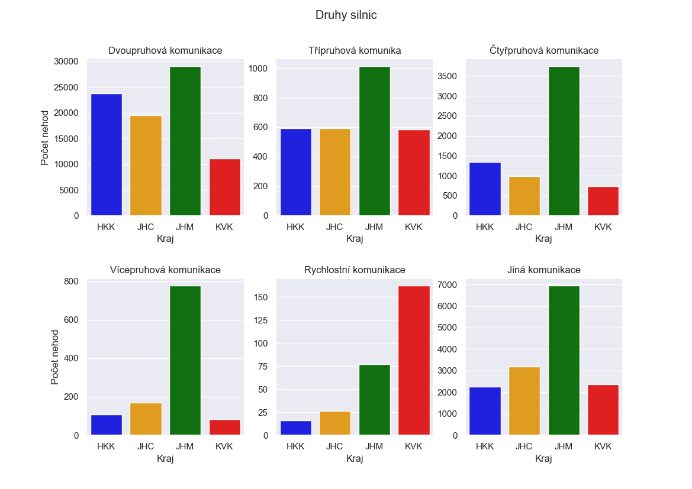
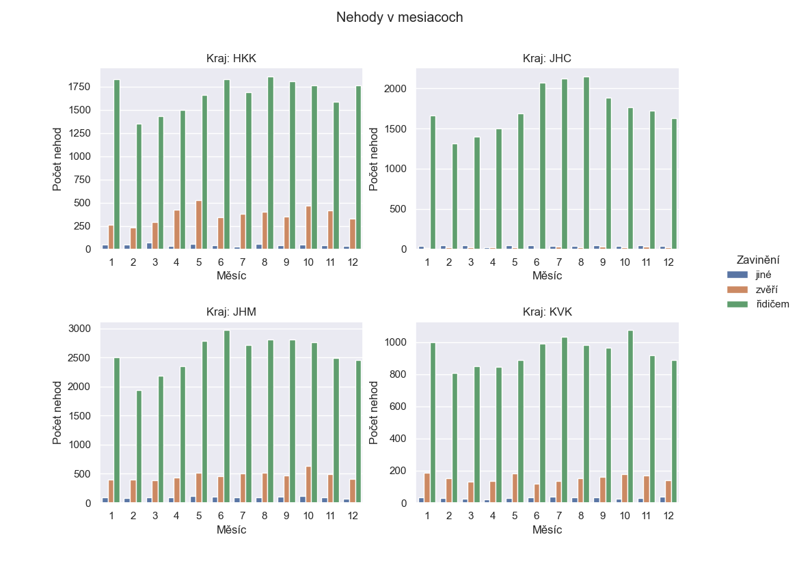
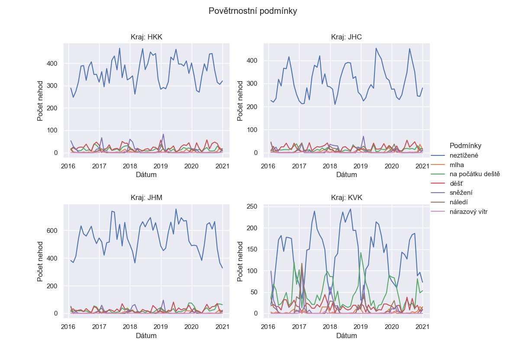

### IZV - Data Analysis and Visualization in Python
#### Project 2 - Data analysis and visualization

-----

`analysis.py` contains functions for analyzing and visualizing accident data. It performs various tasks such as data preprocessing, generating graphs, and analyzing accident counts based on different criteria. The file utilizes libraries such as pandas, seaborn, and matplotlib for data manipulation and visualization.

#### Functions
1. `get_dataframe(filename: str, verbose: bool = False) -> pd.DataFrame`
This function reads the accident data from a file and converts appropriate columns to categorical data types. It also adds a new column with the date in the proper format. The function returns a pandas DataFrame with the modified data types.

Parameters:

- filename (str): The name of the file containing the accident data.
- verbose (bool, optional): If True, information about the size of the DataFrame before and after the type conversion will be printed. Default is False.
- Returns: df (pd.DataFrame): The pandas DataFrame with modified data types and an additional date column.

2. `plot_roadtype(df: pd.DataFrame, fig_location: str = None, show_figure: bool = False)`
This function generates a graph showing the number of accidents in different regions categorized by road type. The graph consists of six subplots representing different road types. The function allows saving the graph to a file or displaying it.

Parameters:

- df (pd.DataFrame): The pandas DataFrame containing the accident data.
- fig_location (str, optional): The name of the file to save the graph. Default is None.
- show_figure (bool, optional): If True, the graph will be displayed. Default is False.

3. `plot_animals(df: pd.DataFrame, fig_location: str = None, show_figure: bool = False)`
This function generates a graph showing the number of accidents in different months categorized by the cause (animals, driver, others). The graph consists of four subplots representing different regions. The function allows saving the graph to a file or displaying it.

Parameters:

- df (pd.DataFrame): The pandas DataFrame containing the accident data.
- fig_location (str, optional): The name of the file to save the graph. Default is None.
- show_figure (bool, optional): If True, the graph will be displayed. Default is False.

4. `plot_conditions(df: pd.DataFrame, fig_location: str = None, show_figure: bool = False)`
This function generates a graph showing the number of accidents over time from the beginning of 2016 to the end of 2020. The accidents are categorized based on weather conditions. The graph consists of four subplots representing different regions. The function allows saving the graph to a file or displaying it.

Parameters:

- df (pd.DataFrame): The pandas DataFrame containing the accident data.
- fig_location (str, optional): The name of the file to save the graph. Default is None.
- show_figure (bool, optional): If True, the graph will be displayed. Default is False.

### Graphs

1. Road type

2. Animals

3. Conditions

----

### Author
- **Name**: Matej Hornik
- **Email**: xhorni20@fit.vut.cz
