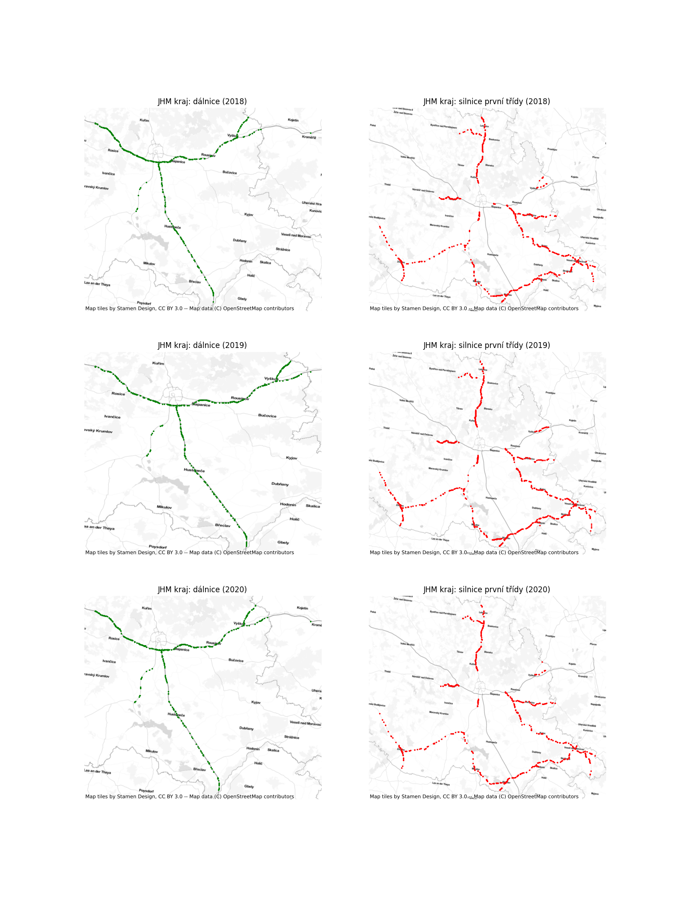

### IZV - Data Analysis and Visualization in Python
#### Project 3 - Geo data analysis and visualization

-----

`geo.py` is a Python script that performs data visualization using geospatial data. It uses various libraries such as pandas, geopandas, matplotlib, contextily, and sklearn.cluster. The script includes two main functions: make_geo and plot_geo.

The `make_geo` function takes in a pandas `DataFrame` and returns a `GeoDataFrame`. It converts the `DataFrame` to a `GeoDataFrame` and sets the coordinate reference system (CRS) to EPSG:4326. It also creates a geometry column from the latitude and longitude columns.

The `plot_geo` and `plot_cluster` functions take in a `GeoDataFrame` and plot the accidents on a map. They filter the data for accidents in the Jihomoravsky kraj region and on 1st class roads. They then create 25 clusters using MiniBatchKMeans and plot the accidents in each cluster. The size of the markers represents the number of accidents in each cluster. The resulting map is saved to a file and/or displayed.

### Graphs

1. Accidents on 1st class roads in Jihomoravsky kraj
This graph shows the accidents in the Jihomoravsky kraj region and on 1st class roads. The size of the markers represents the number of accidents in each cluster.

2. Accidents on 1st class roads in Jihomoravsky kraj (clusters)
This graph shows the accidents in clusters. The size of the markers represents the number of accidents in each cluster.

----

### Author
- **Name**: Matej Hornik
- **Email**: xhorni20@fit.vut.cz